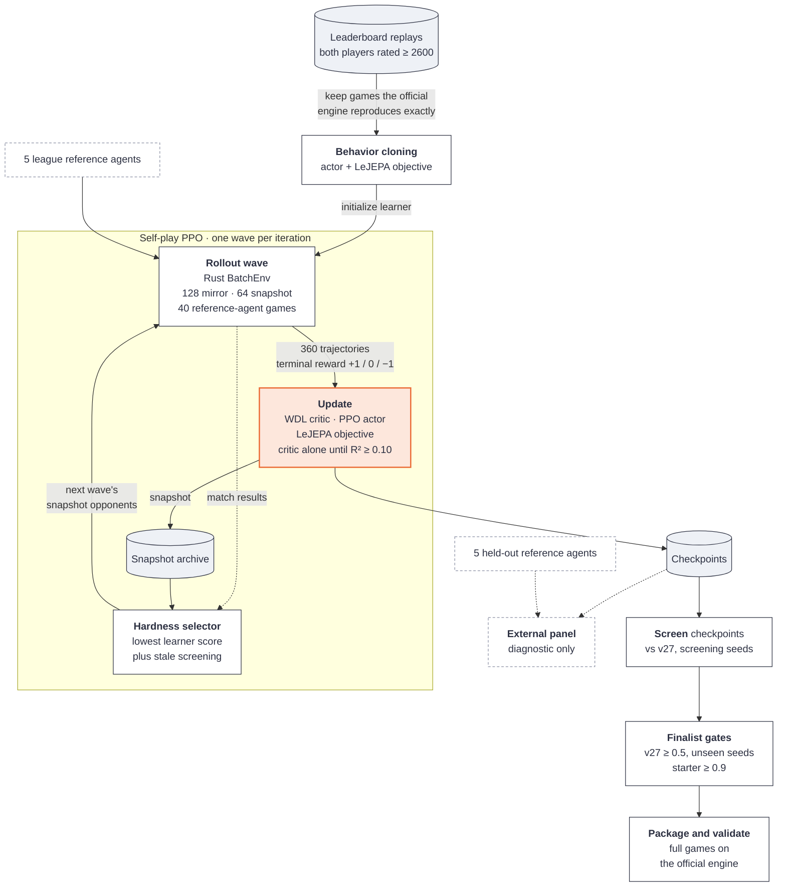
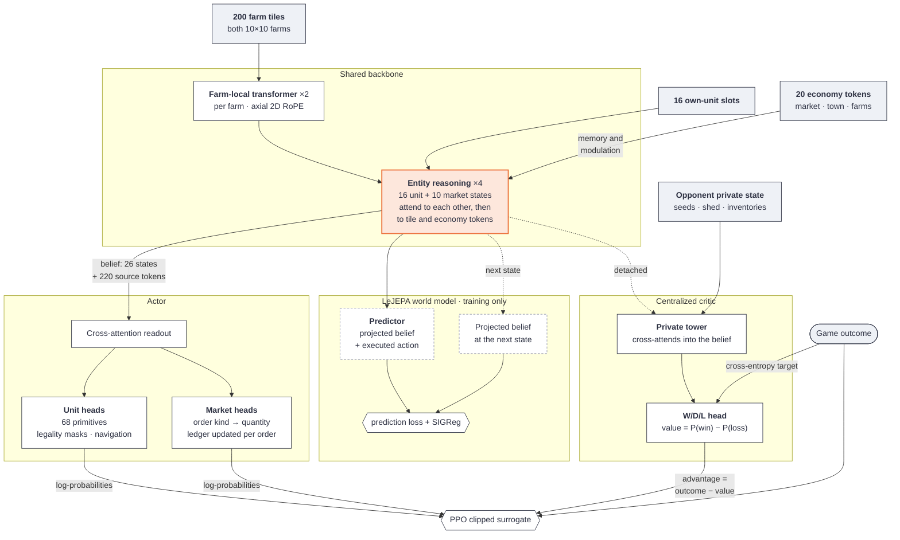

# Kaggriculture

My solution for the 
[Kaggriculture](https://www.kaggle.com/competitions/kaggriculture) competition.
The final submissions placed ~10th of 10,246 teams on the public leaderboard.

I trained an ~947k parameter actor for about 10 hours on an RTX 5090. Behavioural Cloning on leaderboard data from Sept. 27/28 and then a PPO self play league.

Highlights:
- About 2 hours before submission I recognized it was buying 3/4 land plots every game, so I gave it an entropy bonus. It seemed to improve its movement and trading Δ. but did not fix its collapsed strategy in time.
- I should have pretrained my critic on either the leaderboard data I cloned or my BC'd actor, and then it probably wouldn't have suffered from said strategy collapse.
- An ~800k parameter [lejepa](https://arxiv.org/html/2511.08544v3) backbone improved learning speed a lot, and made it easier to share parameters between the actor and critic without worrying about gradient conflict.
- A good league is incredibly important. You want only the toughest opponents, but that is a dynamic class, so I did screening of old versions with high posterior σ.
- Win/Draw/Loss CE critic seems to perform better than any soft reward based on bank-margin, or dense rewards on asset liquidity (which I figured might work as a proxy for final bank).

## Approach


*My final run before submission, in tensorboard. See results/*

<picture>
  <source media="(prefers-color-scheme: dark)" srcset="results/league-3379-dark.png">
  
</picture>

*How often each archived predecessor beats the final submission. See
[`results/`](results/README.md#against-its-predecessors).*



The wave counts are the current defaults. The submitted runs played 168 mirror
and 64 snapshot games per wave, with no reference agents
([`results/`](results/README.md)).

- **Exact native simulator.** `rust/kagg_env` reimplements the game in Rust as a
  batched environment that runs games in parallel (Rayon) and is exposed to
  Python through PyO3. It matches the official engine bit for bit, including
  engine ordering, inventory insertion order, price rounding, and private state.
  A parity oracle checks every public and private field after every transition.
  The official engine remains the final evaluator.
- **Entity-attention policy.** Farms are encoded as 200 tile tokens plus 20
  economy tokens. Twenty-six decision states (16 unit slots and 10 ordered market
  slots) reason over that memory with grouped-query attention. Units choose
  from 68 factored primitives, constrained by legality masks and target
  navigation. Each market slot chooses an order kind, then a quantity, checked
  against a resource ledger that updates after every order.
- **LeJEPA world model.** An action-conditioned latent-prediction objective,
  regularized with SIGReg, trains the shared backbone alongside the policy. The projector and predictor heads,
  which exist just to compute the training loss, are left out.
- **Centralized critic.** The critic reads a detached copy of the shared belief
  plus the opponent's private state, and predicts win, draw, or loss.
- **Training.** The actor is first behavior-cloned on replays of hosted games
  between agents rated 2600 or higher. PPO then continues training with
  terminal win/draw/loss rewards and Monte Carlo credit assignment. Each wave of
  games mixes mirror self-play with a league of past snapshots ranked by how
  hard they are for the current learner.
  The current defaults also add league lanes against public reference agents,
  played natively. A separate held-out set of reference agents is never trained
  against and is used only for evaluation.

Three objectives share one backbone. Policy and LeJEPA gradients both train it.
The critic reads its output detached, so fitting the value never moves the
policy's representation.



[`docs/solution.md`](docs/solution.md) is the full technical reference.
[`results/`](results/README.md) has the TensorBoard logs and lineage of the
runs behind the final submissions.

## Repository layout

| Path | Contents |
| --- | --- |
| `src/kaggriculture/` | Python package: tokenization, models, PPO, league, inference, evaluation |
| `rust/kagg_env/` | Native batched simulator, with its parity and binding-safety tests |
| `scripts/` | Entry points for data extraction, training, evaluation, submission, and probes |
| `tests/` | Test suite; tests marked `cuda` need a GPU |
| `docs/` | Technical reference, game mechanics, and research notes |
| `results/` | TensorBoard logs of the submitted runs (Git LFS) |

## Setup

You need Python 3.11–3.13, [uv](https://docs.astral.sh/uv/), and
[rustup](https://rustup.rs/). Training needs a CUDA GPU.

```bash
uv sync --extra dev --extra train
uv run pytest -m "not cuda"
```

The native extension is compiled with cargo the first time it is imported,
using the toolchain pinned in `rust-toolchain.toml`. To use a different build
directory, set `CARGO_TARGET_DIR`. To check the simulator on its own:

```bash
cargo test --manifest-path rust/kagg_env/Cargo.toml
uv run python rust/kagg_env/tests/parity_oracle.py --build --games 8 --steps 719
cargo run --manifest-path rust/kagg_env/Cargo.toml --release --bin bench_env -- 4096
```

### Reference agents

Evaluation and league training play against public Kaggle agents written by
other competitors. These files are not redistributed here, so you need your own
copies. They go in `~/.local/share/kaggriculture/agents/`
(`$XDG_DATA_HOME/kaggriculture/agents/` if that is set). Set
`KAGGRICULTURE_AGENT_DIR` to use a different directory:

```text
agents/
├── kaggriculture-kaito-v27-main.py       # public v27: default evaluation opponent
├── kaggriculture-boatlee-v16-rc5-main.py # public v16
└── reference/<name>.py                   # league and held-out agents
```

`REFERENCE_AGENTS` in `src/kaggriculture/opponents.py` lists the expected
`<name>`s. They are local labels for public Kaggle agents. Evaluation scripts
also accept the path to any agent file as an opponent.

## Usage

The basic pipeline is: extract a replay corpus from Kaggle's daily episode
datasets (`kaggle/kaggriculture-episodes-YYYY-MM-DD`), behavior-clone, train
with PPO, then evaluate against the public v27 agent:

```bash
uv run python scripts/extract_replay_dataset.py \
  --archives data/episodes/*.zip --key-start 0 --output-dir data/bc/replays
uv run python scripts/train_bc.py --production-model \
  --dataset data/bc/replays --output runs/bc --epochs 16
uv run python scripts/launch_production.py \
  --init-actor-from runs/bc/bc-actor.pt --run-dir runs/ppo --max-hours 10
uv run python scripts/evaluate_checkpoint.py --artifact runs/ppo/latest.pt
```

Rerunning PPO with the same `--run-dir` resumes it. Metrics go to TensorBoard
and `metrics.jsonl` in the run directory. Defaults live in
`src/kaggriculture/production.py`, and every script documents its options in
`--help`. `scripts/build_submission.py` and `scripts/validate_submission.py`
package and check a submission.

## Documentation

- [`docs/solution.md`](docs/solution.md): the production configuration.
- [`docs/mechanics/`](docs/mechanics/overview.md): game rules and constants.
- [`docs/training-reference.md`](docs/training-reference.md): long-form design
  notes and the reasoning behind individual choices.
- [`docs/experiments/`](docs/experiments/): run logs, ablations, and
  campaign records. [`runs.md`](docs/experiments/runs.md) is the main log.
- [`docs/proposals/`](docs/proposals/): design proposals and plans, some
  implemented and some abandoned.
- [`docs/reviews/`](docs/reviews/): RL and performance reviews.

The experiment logs, proposals, and reviews are dated records and are not kept
up to date. Where they disagree with the code, the code is correct.

Third-party code and attributions are listed in
[`THIRD_PARTY_NOTICES.md`](THIRD_PARTY_NOTICES.md).
