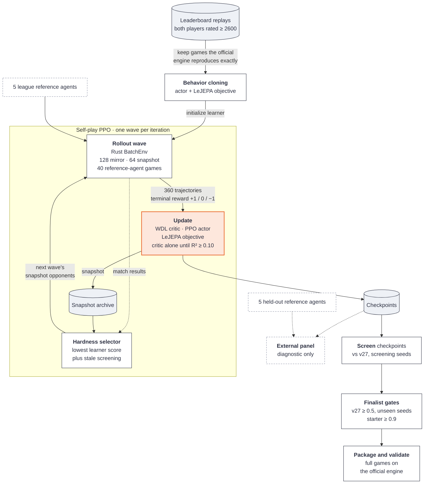

# Kaggriculture

My solution for the 
[Kaggriculture](https://www.kaggle.com/competitions/kaggriculture) competition,
along with the simulator, training, and evaluation tooling used to build it.
The final submissions placed 12th of 10,246 teams on the public leaderboard.

Kaggriculture is a two-player farming economy. Each player runs a 10×10 farm
for 30 in-game days (719 turns). Players plant and harvest crops, raise animals,
hire hands, buy land, and trade on a shared market where prices respond to both
players' sales. Whoever ends with more money in the bank wins. The rules, as
implemented by the pinned `kaggle-environments==1.32.7`, are written up in
[`docs/mechanics/`](docs/mechanics/overview.md).

## Approach


*My final run before submission, in tensorboard. See results/*



The wave counts are the current defaults. The submitted runs played 168 mirror
and 64 snapshot games per wave, with no reference agents
([`results/`](results/README.md)).

- **Exact native simulator.** `rust/kagg_env` reimplements the game in Rust as a
  batched environment that runs games in parallel (Rayon) and is exposed to
  Python through PyO3. It matches the official engine bit for bit, including
  engine ordering, inventory insertion order, price rounding, and private state.
  A parity oracle checks every public and private field after every transition.
  The official engine remains the final evaluator.
- **Entity-attention policy.** Farms are encoded as 200 tile tokens plus 20
  economy tokens. Twenty-six decision states (16 unit slots and 10 ordered market
  slots) reason over that memory with grouped-query attention. Units choose
  from 68 factored primitives, constrained by legality masks and target
  navigation. Each market slot chooses an order kind, then a quantity, checked
  against a resource ledger that updates after every order.
- **LeJEPA world model.** An action-conditioned latent-prediction objective,
  regularized with SIGReg, trains the shared backbone alongside the policy. The projector and predictor heads,
  which exist just to compute the training loss, are left out.
- **Centralized critic.** The critic reads a detached copy of the shared belief
  plus the opponent's private state, and predicts win, draw, or loss.
- **Training.** The actor is first behavior-cloned on replays of hosted games
  between agents rated 2600 or higher. PPO then continues training with
  terminal win/draw/loss rewards and Monte Carlo credit assignment. Each wave of
  games mixes mirror self-play with a league of past snapshots ranked by how
  hard they are for the current learner.
  The current defaults also add league lanes against public reference agents,
  played natively. A separate held-out set of reference agents is never trained
  against and is used only for evaluation.

Three objectives share one backbone. Policy and LeJEPA gradients both train it.
The critic reads its output detached, so fitting the value never moves the
policy's representation.


[`docs/solution.md`](docs/solution.md) is the full technical reference.
[`results/`](results/README.md) has the TensorBoard logs and lineage of the
runs behind the final submissions.

## Repository layout

| Path | Contents |
| --- | --- |
| `src/kaggriculture/` | Python package: tokenization, models, PPO, league, inference, evaluation |
| `rust/kagg_env/` | Native batched simulator, with its parity and binding-safety tests |
| `scripts/` | Entry points for data extraction, training, evaluation, submission, and probes |
| `tests/` | Test suite; tests marked `cuda` need a GPU |
| `docs/` | Technical reference, game mechanics, and research notes |
| `results/` | TensorBoard logs of the submitted runs (Git LFS) |

## Setup

You need Python 3.11–3.13, [uv](https://docs.astral.sh/uv/), and
[rustup](https://rustup.rs/). Training needs a CUDA GPU.

```bash
uv sync --extra dev --extra train
uv run pytest -m "not cuda"
```

The native extension is compiled with cargo the first time it is imported,
using the toolchain pinned in `rust-toolchain.toml`. To use a different build
directory, set `CARGO_TARGET_DIR`. To check the simulator on its own:

```bash
cargo test --manifest-path rust/kagg_env/Cargo.toml
uv run python rust/kagg_env/tests/parity_oracle.py --build --games 8 --steps 719
cargo run --manifest-path rust/kagg_env/Cargo.toml --release --bin bench_env -- 4096
```

### Reference agents

Evaluation and league training play against public Kaggle agents written by
other competitors. These files are not redistributed here, so you need your own
copies. They go in `~/.local/share/kaggriculture/agents/`
(`$XDG_DATA_HOME/kaggriculture/agents/` if that is set). Set
`KAGGRICULTURE_AGENT_DIR` to use a different directory:

```text
agents/
├── kaggriculture-kaito-v27-main.py       # public v27: default evaluation opponent
├── kaggriculture-boatlee-v16-rc5-main.py # public v16
└── reference/<name>.py                   # league and held-out agents
```

`REFERENCE_AGENTS` in `src/kaggriculture/opponents.py` lists the expected
`<name>`s. They are local labels for public Kaggle agents. Evaluation scripts
also accept the path to any agent file as an opponent.

## Usage

Each entry point documents its options in `--help`. The model and PPO defaults
live in `src/kaggriculture/production.py`. The commands below follow the recipe
behind the final submissions. [`results/`](results/README.md) shows where
those runs departed from the current defaults.

**1. Build a demonstration corpus** from Kaggle's daily leaderboard episode
datasets (`kaggle/kaggriculture-episodes-YYYY-MM-DD`). Each episode is replayed
through the official engine, and kept only if both players' final balances
reproduce exactly:

```bash
uv run python scripts/extract_replay_dataset.py \
  --archives data/episodes/*.zip --key-start 0 --output-dir data/bc/replays
```

**2. Behavior-clone the production actor.** `--production-model` fixes the
architecture, but the training schedule is set separately. The submitted clone
used the following schedule:

```bash
uv run python scripts/train_bc.py --production-model \
  --dataset data/bc/replays --output runs/bc \
  --epochs 16 --holdout-seeds 16 --run-length 2 --shard-seats 1000
```

**3. Train with PPO**, starting from the cloned actor. Training stops after
`--iterations` (default 500) or `--max-hours`. To resume, rerun with the same
`--run-dir`; training continues from its latest checkpoint. The default league
plays the five league reference agents, so install them first.

```bash
uv run python scripts/launch_production.py \
  --init-actor-from runs/bc/bc-actor.pt --run-dir runs/ppo --max-hours 10
```

For full control over every training option, use `scripts/train_ppo.py`.
`scripts/launch_calibrated_training.py` takes matched eager, mixed, and
compiled benchmark reports, chooses the compile mode from them, and records
that decision in the run's provenance.

**4. Select and evaluate.** First, score every checkpoint in a run on one seed
panel and keep the best. Then evaluate that checkpoint on finalist seeds that
were not used for selection. Run this evaluation twice. The first run uses the
default opponent, the public v27 agent, which the submission builder requires.
The second uses the engine's `starter` agent:

```bash
uv run python scripts/select_checkpoint.py --run-dir runs/ppo \
  --output evaluations/screen.json --best-output runs/ppo/best.pt
uv run python scripts/evaluate_checkpoint.py --artifact runs/ppo/best.pt \
  --seed-domain finalist --selection-report evaluations/screen.json \
  --output evaluations/finalist.json
uv run python scripts/evaluate_checkpoint.py --artifact runs/ppo/best.pt \
  --opponent starter --seed-domain finalist --selection-report evaluations/screen.json \
  --output evaluations/starter.json
```

**5. Package and validate a submission.** The builder will not package a
checkpoint unless its provenance and evaluation evidence match. The checkpoint
must also score at least 0.5 against v27 and 0.9 against `starter`. The validator
then plays the exact archive in full-length games on the official engine:

```bash
uv run python scripts/build_submission.py --checkpoint runs/ppo/best.pt \
  --evaluation-report evaluations/finalist.json \
  --builtin-evaluation-report evaluations/starter.json \
  --output artifacts/submission.tar.gz
uv run python scripts/validate_submission.py --archive artifacts/submission.tar.gz
```

Training metrics are written to TensorBoard and to `metrics.jsonl` in each run
directory.

## Documentation

- [`docs/solution.md`](docs/solution.md): the production configuration.
- [`docs/mechanics/`](docs/mechanics/overview.md): game rules and constants.
- [`docs/training-reference.md`](docs/training-reference.md): long-form design
  notes and the reasoning behind individual choices.
- [`docs/experiments/`](docs/experiments/): run logs, ablations, and
  campaign records. [`runs.md`](docs/experiments/runs.md) is the main log.
- [`docs/proposals/`](docs/proposals/): design proposals and plans, some
  implemented and some abandoned.
- [`docs/reviews/`](docs/reviews/): RL and performance reviews.

The experiment logs, proposals, and reviews are dated records and are not kept
up to date. Where they disagree with the code, the code is correct.

Third-party code and attributions are listed in
[`THIRD_PARTY_NOTICES.md`](THIRD_PARTY_NOTICES.md).
