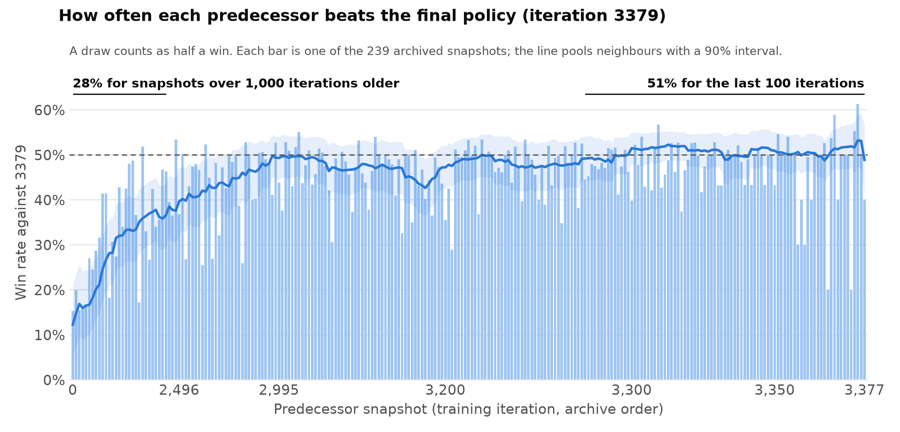

# Results

TensorBoard logs for the behavior-cloning and PPO runs behind the final
competition submissions.

## Final submissions

| Submission | Checkpoint | Public score |
| --- | --- | --- |
| `ppo-overnight-1260` | `ppo-overnight`, iteration 1260 | 2853.4 |
| `ppo-overnight-lr3-3379` | `ppo-overnight-lr3`, iteration 3379 | 2793.9 |
| `ppo-overnight-lr3-3085` | `ppo-overnight-lr3`, iteration 3085 | 2777.6 |

Kaggle counts each team's two most recent submissions. Those were the two
`ppo-overnight-lr3` checkpoints, which placed 12th of 10,246 teams on the public
leaderboard (snapshot of 2026-10-02 UTC).

## Against its predecessors

<picture>
  <source media="(prefers-color-scheme: dark)" srcset="league-3379-dark.png">
  
</picture>

Each bar is one archived snapshot's win rate against iteration 3379, counting
a draw as half a win. Snapshots more than 1,000 iterations older win 28% of
the time. The earliest ones win about 15%. Snapshots from the last 100
iterations win 51%, which is expected because they play almost the same
policy. The bars run in archive order, and the archive's spacing doubles with
age, so the x-axis is roughly logarithmic.

The data is the league's own matchup record, stored in the checkpoint. Each
snapshot's record is a decayed tally of its most recent games against the
learner, all played within 44 iterations of 3379 at temperature 1. A single
record is often only five to eight games, so each bar is shrunk toward 50% by
the selector's Beta(1, 1) prior. The line pools neighbouring snapshots and
carries the signal. The numbers are in [`league-3379.json`](league-3379.json),
and [`scripts/plot_league_evidence.py`](../scripts/plot_league_evidence.py)
regenerates both from a checkpoint.

## Lineage

```text
bc ──► ppo-overnight (iterations 1–2535) ──► ppo-overnight-lr3 (iterations 2536–3379)
```

- **`bc`**: the production `lejepa` actor behavior-cloned for 16 epochs on
  replays of 2026-09-27 and 2026-09-28 leaderboard games between agents rated at
  least 2600 (observation schema 8, action interface 2). One step is one epoch.
- **`ppo-overnight`**: PPO from the `bc` actor with a fresh win/draw/loss
  critic. Each wave is 232 games: 168 mirror self-play games plus 64 games
  against a hardness-ranked league of the learner's own past snapshots. No
  reference agents were used. Terminal win/draw/loss reward, actor learning
  rate 5e-5, no entropy bonus.
- **`ppo-overnight-lr3`**: resumed from `ppo-overnight` iteration 2535 with
  three times the actor learning rate (1.5e-4) and a 1e-4 entropy bonus. The
  last 125 iterations anneal the actor learning rate linearly toward zero. The log here
  starts at iteration 2536; the earlier history is the `ppo-overnight` log.

## Viewing

The event files (about 100 MB) are stored with [Git LFS](https://git-lfs.com/).
They are not downloaded on clone. To fetch them and start TensorBoard:

```bash
git lfs pull --include 'results/tensorboard/**' --exclude ''
uv run --extra train tensorboard --logdir results/tensorboard
```

Plot the two PPO runs together to see one continuous curve from iteration 1 to
3379.
